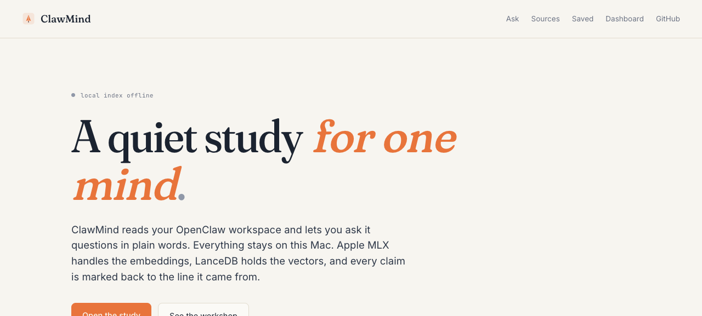

# ClawMind

Local-first RAG over your notes, sessions, and project files. Ask questions, get cited answers.



## What it does

ClawMind indexes a directory tree (default: `~/.openclaw/workspace`) into a hybrid retrieval store, then answers natural-language questions against it with inline citations to the source files. Documents are chunked, embedded with a local MLX model (with an OpenAI-compatible fallback), and written to LanceDB for dense search and a BM25 index for lexical search. Queries hit both, are merged and reranked, and the top chunks are passed to a configurable LLM (local Hermes by default, Copilot fallback) which produces a grounded answer. Files are automatically bucketed into namespaces (`memory`, `sessions`, `projects`, `docs`, `misc`) based on their path so you can scope retrieval. State lives on disk: nothing leaves the box unless you point it at a remote model.

## Features

- Hybrid retrieval: LanceDB dense vectors + BM25 lexical, merged with MMR
- Namespaces inferred from path (memory / sessions / projects / docs / misc) for scoped queries
- Streaming and non-streaming `/ask` with cited spans back to source files
- Saved searches with snapshot history so you can diff results over time, plus inline rename, taggable groups, and a tag filter on the Saved page
- Collections: group saved searches into named folders (with an accent color and an optional description) so onboarding playbooks stay separate from incident reviews. The `/collections` page lists every folder with a live count, lets you create, rename, recolor, or delete folders, and opens an inline drawer where you tick saved searches in or out without leaving the page. Backed by `/v1/collections` and `/v1/collections/:id/members`, isolated per user, and gated by the `collections:read` / `collections:write` scopes for API keys
- Pins, mutes, and aliases to bias or exclude paths from retrieval
- Tags on files, browsable as facets
- Search workspace: `/search` runs hybrid retrieval with namespace chips, include and exclude tag filters (auto-completing against your tag library), client-side sort and pagination, recent searches persisted in `localStorage`, and full filter state in the URL so a shared link restores the exact view
- Conversations: multi-turn threads with archive, fork, rename, Markdown export, and full-text search across titles and message content with highlighted snippets, paginated results, and a `/`-to-focus search box
- History export: download every past ask as `.json`, `.csv`, or `.md`, with the same search and namespace filters the History page is showing
- Per-question tags on history: add freeform tags to any past Q&A and filter the History page by one or more tags. Tags live in `history-tags.json` keyed by user, are scoped by the `history:read` / `history:write` API key scopes, and are returned inline on `GET /v1/history` so the page renders in one round trip
- Rename any history entry to a memorable title ("Q3 launch plan", "deck refs") so the History page scans like a notebook instead of a wall of raw questions. Titles are per-user, kept in `history-titles.json`, returned inline on `GET /v1/history`, and editable via `PATCH /v1/history/<id>` (empty title clears the rename)
- Feedback (thumbs / notes) on answers, used to mark good or bad chunks
- Digests: scheduled recurring queries (e.g. "what changed this week in projects/")
- Stale source detection (files indexed but not seen on disk recently)
- Related-document lookup and basic stats / doctor endpoints
- API keys with per-key rate limiting, GitHub OAuth or single-user mode. Each key carries a per-key usage log (`GET /v1/keys/:id/usage`) with 24h and 7d request totals, success vs error split, top routes, and the last 10 calls so you can confirm a key is in use before rotating or revoking it. The `/keys` page exposes the same report inline behind a Usage toggle per row. When you mint a new key the issued-secret panel and a permanent reference section at the bottom of `/keys` show copy-pasteable `curl` snippets for `/v1/ask`, `/v1/search`, and `/v1/history` (pre-filled with your real secret on issue, otherwise `$CLAWMIND_KEY`) so a first-time user is one paste away from a working API call.
- Outbound webhooks: register a URL, get signed POSTs on `ask.completed` and `ingest.completed`, with automatic retries and a delivery log
- Batch ask: paste or upload a CSV of up to 100 questions, get a results table plus a one-click CSV download. Every row is saved to history and counts against the monthly quota.
- Usage meter: per-user monthly request count, free-tier quota with 429 on overrun, and an in-app `/usage` page with reset countdown and upgrade CTA
- Shareable read-only answer links, created in one click from the Share button under any finished chat answer, with per-share OpenGraph cards (dynamic 1200x630 image, Twitter `summary_large_image`, title and snippet) so a pasted `/s/<id>` URL renders as a rich preview in Slack, iMessage, and X. The public `/s/<id>` page also renders the cited sources (path, line range, excerpt), the share timestamp, a copy-link button, and a Try ClawMind CTA so first-time viewers can convert into users. The `/shares` page lists every link you created, with view counts, copy-link, and one-click revoke so a leaked URL is easy to kill
- Installable PWA: web app manifest, offline shell, and in-app install prompt so the web UI lives on your home screen with quick shortcuts to Ask, Search, and Saved
- Account settings: `/settings` shows your user id and plan, a live usage meter, system health, shortcuts to keys and webhooks, a one-click JSON export of every per-user record, and a type-to-confirm GDPR delete that audit-logs the wipe
- Editable profile: `GET /v1/me` and `PATCH /v1/me` back a display name, IANA timezone, and default model preference per user. The settings page exposes an inline edit form (with a one-click Use local timezone helper) so a returning user can rename themselves, pin their timezone, and lock in a preferred model without leaving the page. Profiles are stored per-user in `profiles.json`, isolated by `userId`, and gated by the `profile:read` / `profile:write` scopes for API keys
- Onboarding: `/welcome` is a three-step first-run guide (ingest a source, ask your first question, create an API key) with per-user server-side progress, a one-click button to index the bundled sample pack, and a dismiss/restore toggle so the guide stops nagging once you are set up
- Audit log review: an owner-only `/audit` page that surfaces every mutation written to the hash-chained log. Filter by actor, action substring, resource prefix, and time window, page 50 at a time, expand any row to inspect the raw JSON, and click Verify chain to replay the on-disk hashes and prove the file has not been tampered with. Use the **Export JSONL** or **Export CSV** buttons to stream the full filtered chain straight to disk for SOC2 / regulator pulls that exceed the 1000-row query cap. Backed by `GET /v1/admin/audit`, `GET /v1/admin/audit/verify`, and `GET /v1/admin/audit/export?format=jsonl|csv`, all gated by the `audit:read` scope. The export itself is recorded in the audit log together with the head hash at the moment of export so a downloaded file can be pinned to an exact chain state later.
- IP allowlist for the whole account: a `/settings/security` page lets the owner add a list of trusted IPv4 / IPv6 addresses or CIDR blocks (office egress, VPN range, CI runner subnet) and flip a single switch to enforce it. When enforcement is on, every request that is not on the list gets a `403 ip_not_allowed`, regardless of whether it presents a session cookie or a Bearer API key. The settings endpoint itself is deliberately exempt so a typo can never lock the account out. Rules are normalised (`10.0.0.5/24` becomes `10.0.0.0/24`), duplicates are rejected, denials are written to the audit log, and the whole document is per-user isolated in `ip-allowlist.json`. Backed by `GET` / `PUT /v1/ip-allowlist` and the new `ip-allowlist:read` / `ip-allowlist:write` API key scopes.
- Active sessions with force-logout: a `/settings/sessions` page lists every browser currently signed in to the account with its short user-agent, IP, sign-in time, and last-seen time, and the current browser is clearly marked. Revoking a single session or hitting the "sign out everywhere else" button writes a tombstone to the per-user `sessions.json` registry; the next request from that session id is rejected with `401 session revoked` by the API auth hook even though the cookie still decrypts. Sids are stored as `sha256` hashes so a leaked registry file is not a leaked cookie. Every revoke is written to the audit log, and the registry is gated by the new `sessions:read` / `sessions:admin` API key scopes via `GET /v1/sessions`, `DELETE /v1/sessions/:id`, and `POST /v1/sessions/revoke-all`.
- Enterprise SSO via OIDC: ClawMind can require single sign-on against any spec-compliant provider (Google Workspace, Okta, Azure AD / Entra ID, Auth0, Keycloak) without code changes. Set `CLAWMIND_AUTH_MODE=oidc` plus `CLAWMIND_OIDC_ISSUER`, `CLAWMIND_OIDC_CLIENT_ID`, `CLAWMIND_OIDC_CLIENT_SECRET`, and `CLAWMIND_OIDC_REDIRECT_URI` and the API exposes `GET /auth/oidc` (start) and `GET /auth/oidc/callback` (finish). The discovery document is fetched on demand, ID tokens are verified RS256-against-JWKS with audience, issuer, nonce, and expiry checks, the state and nonce are cookie-bound and single-use, and successful logins record a `sso.login` event in the hash-chained audit log. `CLAWMIND_OIDC_ALLOWED_DOMAINS=acme.com,acme.co.uk` restricts sign-in to verified emails in those domains so a contractor with a personal Gmail cannot create an account. The owner-only `/settings/sso` page shows live status (configured, enforced, issuer, client id, redirect URI, allowed domains) for procurement and IT review without ever exposing the client secret.
- Multi-factor authentication (TOTP, RFC 6238): owner accounts can enroll an authenticator app at `/settings/mfa`. The endpoint set is `GET /v1/mfa/status`, `POST /v1/mfa/enroll`, `POST /v1/mfa/confirm`, `POST /v1/mfa/verify`, `POST /v1/mfa/recovery/regenerate`, `DELETE /v1/mfa`, all gated by the new `mfa:read` / `mfa:admin` scopes. Enrollment hands out a 160-bit base32 secret and ten single-use recovery codes (sha256-hashed on disk so a leaked `mfa/<userId>.json` is not a leaked code). The auth plugin exposes a `requireMfa` decorator that demands a successful step-up within a configurable window (default 15 minutes) before sensitive routes will run: key issuance, key revoke and rotate, account hard-delete, IP allowlist edits, maintenance compact and forget, single-session and bulk session revoke, and every webhook mutation. API key callers bypass MFA because their authorization is the scope set bound to the key; cookie-session callers without a fresh code get `401 mfa step-up required` with `x-mfa-required: 1`. Replay protection rejects the same TOTP counter twice in the acceptance window, and every verify, recovery use, and failure is written to the hash-chained audit log.
- Data retention policy: an owner-only `/settings/retention` page that lets you cap how long ClawMind keeps your ask history and conversations before auto-erasing them, the single biggest GDPR/CCPA blocker in procurement reviews. Three independent knobs (history days, conversation days, audit retention hint) accept an integer between 1 and 3650 days or blank for "keep forever". A dry-run preview reports exactly how many records the sweep would remove before you commit; the apply button only enables when the preview shows nonzero deletes and prompts for confirmation. The audit chain is deliberately never silently truncated, even when an `auditDays` hint is set, so SOC2 evidence stays intact. Backed by `GET /v1/retention`, `PUT /v1/retention`, and `POST /v1/retention/apply?dry_run=true|false`, gated by the new `retention:read` / `retention:admin` API key scopes, and every mutation plus every applied sweep writes to the hash-chained audit log with before/after diffs.
- Members and RBAC (4 roles): the new owner-only `/settings/members` page makes ClawMind a real multi-user product. Every authenticated user is recorded in `members.json` with one of `owner`, `admin`, `member`, or `viewer`; the first user to ever log in is auto-bootstrapped as the owner so the deployment is never role-less. Admins can invite teammates, change roles, and remove members; only owners can mint or demote other owners, and the registry refuses to let the last owner be demoted or removed so a workspace cannot be orphaned. The new `requireMinRole` decorator gates the routes hierarchically (`owner > admin > member > viewer`), invites are MFA stepped, and every promote, demote, invite, and removal writes a before/after diff into the hash-chained audit log. Backed by `GET/POST /v1/members`, `PATCH /v1/members/:userId`, `DELETE /v1/members/:userId` and the new `members:read` / `members:admin` scopes; DELETE supports `?dry_run=true` for safe what-if checks.
- Domain auto-join policies: an owner or admin can list verified email domains at `/settings/domains` and set `member` or `viewer` as the default role for any first-time sign-in from that domain, so onboarding a 200-person org across SSO does not require 200 individual invites. The policy table is replaced atomically (no partial writes), case-insensitive on the domain, hard-capped at 50 entries, and refuses to ever auto-grant `admin` or `owner` so a compromised email provider cannot escalate. Existing members are never silently promoted or demoted: policies only apply to brand-new users on their first login. Backed by `GET /v1/domain-policies` and `PUT /v1/domain-policies` (with optional `dryRun`), gated by the new `domain-policies:read` / `domain-policies:admin` scopes, MFA-stepped on mutate, and every replace plus every denied attempt writes a before/after diff into the hash-chained audit log.
- Email-token invitations: a workspace owner or admin can send a one-time invitation link bound to a specific email at `/settings/invitations`, instead of needing to know the recipient's OIDC subject up front. POST `/v1/invitations` mints a 32-byte token, returns it once, and stores only `sha256(token)` so a leaked `invitations.json` does not let an attacker walk in through a pending invite. The recipient lands on `/invitations/accept?token=...` where the UI peeks the role and expiry without consuming the token, then accept verifies the signed-in user's email matches the one the invite was issued to (defence against link forwarding). Accept is single-use, expirable (1, 7, 14, or 30 days), and on success calls `inviteMember()` so the recipient drops into the registry at the pre-bound role on their next OIDC login. List/peek/create/revoke are all MFA stepped under the new `invitations:read` / `invitations:admin` scopes, and every mint, accept, revoke, and denial writes a before/after diff into the hash-chained audit log.
- SCIM 2.0 provisioning: an owner-only `/settings/scim` page lets the workspace mint a single bearer token that an identity provider (Okta, Azure AD, Google Workspace, Auth0, OneLogin, JumpCloud) uses to push users into ClawMind on assignment and pull them out on offboarding. The protocol surface lives at `/scim/v2/Users` and covers `GET` (with `filter=userName eq "x"`, `startIndex`, `count`), `GET/:id`, `POST`, `PATCH` (active flag and role, including Okta's `replace path=active value=false` deprovision shape), and `DELETE`, plus the discovery endpoints `ServiceProviderConfig`, `ResourceTypes`, and `Schemas`. Users are projected one-to-one from the existing member registry so SCIM and the in-app `/settings/members` UI can never disagree about who has access; `active=false` soft-suspends to `viewer` instead of deleting so audit history stays attached, and the last-owner protection refuses both deprovision and delete so a misconfigured IdP cannot orphan the workspace. The token is shown plaintext exactly once on rotation, only its sha256 digest is persisted, lifecycle is owner+MFA gated, and every SCIM create, patch, delete, and denial is written to the hash-chained audit log with actor `scim:<token-id>` so SOC2 reviewers can trace which IdP action provisioned which user. See `docs/SCIM.md` for IdP setup.
- SCIM 2.0 user provisioning: enterprise IdPs (Okta, Azure AD / Entra ID, Google Workspace, OneLogin) can push the full user lifecycle into ClawMind without the workspace owner clicking invite links by hand. The owner mints a single workspace bearer token at `/settings/scim` (plaintext shown exactly once, sha256 digest stored on disk, MFA-gated to rotate or revoke) and points the IdP at `/scim/v2`. The protocol surface is RFC-compliant: `GET /scim/v2/ServiceProviderConfig`, `/ResourceTypes`, `/Schemas`, plus full `Users` CRUD with `userName eq` filtering, RFC 6902-style PATCH for active flag and role, `application/scim+json` content type, and standard 401 / 404 / 409 SCIM error envelopes with `scimType=uniqueness` on conflicts. Users project one-to-one from the existing `members.json` registry (no parallel user table to drift), the role lives on the schema extension `urn:ietf:params:scim:schemas:extension:clawmind:2.0:User`, `active=false` softly demotes to viewer instead of orphaning audit history, and the registry refuses to deprovision the last remaining owner. Every create, patch, delete, and denial is written to the hash-chained audit log with the actor stamped as `scim:<tokenId>` so an auditor can tell IdP-driven changes apart from in-app ones.
- Admin console: a single owner-only `/admin` page that aggregates every security control on the tenant into one screen so an enterprise reviewer can answer "is this configured safely" without clicking through eight separate settings panels. SSO status, MFA enrollment, active sessions, API key counts and last-used time, 24h webhook deliveries and failures, IP allowlist state, data retention windows, and the current audit chain head hash all surface in one round trip via `GET /v1/admin/overview`. Every number comes from the same services the dedicated routes use so the overview cannot drift from reality. Owner-gated, `admin:read` scoped, and the fetch itself appends an `admin.overview` row to the hash-chained audit log so the act of reviewing posture leaves its own trace.

- Notifications inbox: an in-app `/notifications` page plus a live bell badge in the top nav, so you find out when someone opens a share you minted or when one of your webhooks gets auto-paused after repeated failures. No email, no SMS, no third-party push. Notifications dedupe per share (every refresh just bumps the existing row's view count), cap at 200 per user, and ship with mark-read, mark-all-read, remove, and clear. Per-user notification preferences at `/settings/notifications` (or `GET`/`PUT /v1/notification-preferences`) let you toggle each kind (share views, webhook failures, webhook auto-disabled, system messages) on or off; switched-off kinds are dropped at the producer with `shouldDeliver()` before they ever reach the inbox, so you never see another row of a category you muted
- File watcher for incremental reindex
- Local MLX embeddings with automatic fallback to an OpenAI-compatible endpoint

## Stack

- Node 20+, TypeScript, pnpm workspaces, Turborepo
- API: Fastify 5, Zod, `@fastify/session`, `@fastify/rate-limit`
- Web: Next.js 15 (App Router), React 19, Tailwind v4
- CLI: commander, ora, kleur
- Vector store: LanceDB
- Lexical: in-process BM25 index persisted to JSON
- Embeddings: MLX sidecar (Python, FastAPI) serving `bge-small-en-v1.5-4bit` by default
- LLM: any OpenAI-compatible chat completions endpoint
- Telemetry: pino logging, optional OTLP traces
- Tests: vitest, Playwright (web e2e)

## Architecture

The repo is a pnpm workspace. `apps/api` is the Fastify HTTP service, `apps/web` is the Next.js UI, `apps/cli` is the `clawmind` command. Domain logic lives in `packages/*`: `ingest` (loaders, chunkers, watcher, manifest), `embed` (MLX + OpenAI clients with fallback), `store` (LanceDB wrapper, BM25 index, ingest manifest, audit log), `rag` (retrieval, MMR, prompt assembly), `llm` (chat clients), `config`, `types`, `telemetry`, and `ui`. Ingest walks the workspace, applies a gitignore-style filter, hashes each file against the manifest to skip unchanged content, loads it through a typed loader (markdown / code / json / pdf / html), chunks it with a sliding or semantic chunker, embeds each chunk, and writes vectors to LanceDB plus tokens to BM25. Query path: the API embeds the question, runs BM25 and dense KNN in parallel, merges with a hybrid alpha, applies MMR for diversity, builds a prompt under a token budget, and streams the LLM response back with citation spans pointing at `path` + line range.

```
                   ┌──────────────┐
files on disk ───▶ │  ingest      │ ─chunks─▶ embed sidecar (MLX)
                   │  pipeline    │              │
                   └──────┬───────┘              ▼
                          │                  vectors
                          ▼                      │
                   manifest.json                 ▼
                                          ┌───────────┐
                          ┌──tokens─────▶ │  LanceDB  │
                          ▼               └───────────┘
                     ┌─────────┐                ▲
                     │  BM25   │                │
                     └─────────┘                │
                          ▲                     │
                          └────── query ────────┘
                                    │
                                    ▼
                            hybrid merge + MMR
                                    │
                                    ▼
                            prompt + citations
                                    │
                                    ▼
                              LLM (Hermes /
                              Copilot fallback)
```

## Quick start

Requirements: Node 20.10+, pnpm 9, Python 3.11+ (for the embed sidecar), and an OpenAI-compatible chat endpoint reachable at `CLAWMIND_LLM_PRIMARY_URL`.

```bash
git clone https://github.com/Sanjays2402/clawmind.git
cd clawmind
pnpm install
cp .env.example .env

# Start the MLX embed sidecar (port 7411)
cd packages/embed/python
pip install -r requirements.txt
python server.py &
cd -

# Start API (7410) + Web (7412) + CLI in watch mode
pnpm dev

# In another shell, index your workspace
pnpm clawmind ingest ~/.openclaw/workspace

# Ask something
pnpm clawmind ask "what did I decide about the embed model last week?"
```

The web UI is at <http://127.0.0.1:7412>. The API listens on <http://127.0.0.1:7410>. Data (LanceDB, BM25 index, manifest, audit log) is written to `CLAWMIND_DATA_DIR` (default `./data`).

Or check the live SSO configuration the API has loaded. Use this for a procurement / IT review when you need to prove that `CLAWMIND_AUTH_MODE=oidc` is enforced and that the deployment is pointed at the right issuer and allowed domains. The endpoint never returns the client secret:

```bash
curl http://127.0.0.1:7410/auth/sso/config
# {"enabled":true,"enforced":true,"issuer":"https://accounts.google.com",
#  "clientId":"...","redirectUri":"https://your-host/auth/oidc/callback",
#  "allowedDomains":["acme.com"],"scopes":"openid email profile","mode":"oidc"}
```

The same data is rendered at <http://127.0.0.1:7412/settings/sso>, which also offers a Continue-with-SSO button that round-trips through `/auth/oidc` to your IdP and back through `/auth/oidc/callback` so you can confirm the full flow before handing the URL to your security team.

### Try it in 30 seconds

Ingest the bundled sample knowledge pack and open the live demo page. It ships three preloaded sample questions you can click to see real retrieval, streaming answers, and inline citation chips against your local model. Each citation in the answer is clickable: it highlights the matching source card in the rail and scrolls it into view, and clicking a source card lights up every citation in the answer that points at it.

```bash
pnpm clawmind ingest ./samples
pnpm dev
open http://127.0.0.1:7412/demo
```

Or open the retrieval explain page at <http://127.0.0.1:7412/explain> to see why each chunk was picked: raw BM25, raw dense cosine, normalised values, hybrid blend, lexical rerank, and MMR rank are all rendered as side-by-side bars. Sliders let you tune alpha, lambda, and k and re-run the same pipeline /v1/ask uses, without spending an LLM call.

Or browse <http://127.0.0.1:7412/history> to search every past question, expand the full answer with its cited source excerpts, and click "Ask again" to re-run any of them in the chat. Free-text and namespace filters call the same `/v1/history` endpoint server-side so the page stays fast even with thousands of entries:

```bash
curl 'http://127.0.0.1:7410/v1/history?q=kernel&namespaces=memory&limit=20'
```

Tag a past question, then narrow History to just that tag (also surfaced as clickable chips at the top of <http://127.0.0.1:7412/history>):

```bash
curl -X PUT 'http://127.0.0.1:7410/v1/history/<id>/tags' \
  -H 'content-type: application/json' \
  -d '{"tags":["travel","research"]}'

curl 'http://127.0.0.1:7410/v1/history?tags=travel&limit=50'
```

Rename a noisy question to something you can scan in a list. Send an empty title to revert to the original query:

```bash
curl -X PATCH 'http://127.0.0.1:7410/v1/history/<id>' \
  -H 'authorization: Bearer <api-key-with-history:write>' \
  -H 'content-type: application/json' \
  -d '{"title":"Q3 launch plan"}'
```

Or open <http://127.0.0.1:7412/conversations> to find any past thread by title or by something you (or the assistant) said inside it. The search box is debounced, hits show a highlighted snippet of the matching turn, results paginate at 25 per page, and pressing `/` from anywhere on the page jumps focus into the search field. The same endpoint backs every query:

```bash
curl 'http://127.0.0.1:7410/v1/conversations?q=snip&limit=25&offset=0'
```

Or open <http://127.0.0.1:7412/welcome> on a fresh account for the three-step first-run guide. The page reads per-user progress from `/v1/onboarding`, marks each step done as you complete the underlying product action (ingest a source, ask a question, create an API key), and surfaces a one-click button to index the bundled sample pack so a brand new install can be useful in under a minute. The same endpoint powers a future home-page nudge, and progress survives logout:

```bash
# read current onboarding state
curl -s http://127.0.0.1:7410/v1/onboarding | jq '.progress'

# mark a step done manually (the API also auto-marks on real actions)
curl -s -X POST http://127.0.0.1:7410/v1/onboarding/complete \
  -H 'content-type: application/json' \
  -d '{"step":"ingest"}'
```

Or open <http://127.0.0.1:7412/settings> for the account control center: live usage meter, system health, shortcuts to API keys and webhooks, a one-click JSON export of every per-user record, and a type-to-confirm delete that wipes history, conversations, saved items, feedback, and keys for your account. Both lifecycle actions are audit-logged.

```bash
curl -OJ http://127.0.0.1:7410/v1/me/export
curl -X DELETE http://127.0.0.1:7410/v1/me/data \
  -H 'content-type: application/json' \
  -d '{"confirm":"DELETE"}'

# Read and update your profile (display name, IANA timezone, default model)
curl -s http://127.0.0.1:7410/v1/me | jq '.profile'
curl -s -X PATCH http://127.0.0.1:7410/v1/me \
  -H 'content-type: application/json' \
  -d '{"displayName":"Alice","timezone":"America/Los_Angeles","defaultModel":"gpt-4o-mini"}'
```

Or lock the account down to your trusted networks at <http://127.0.0.1:7412/settings/security>. Add your office egress IP, your VPN range, and any CI runner subnet, flip the switch on, and every request from anywhere else is rejected with a `403 ip_not_allowed`. The settings page itself is exempt so a bad rule can never lock you out, and every denial lands in the audit log:

```bash
# Read the current allowlist + limits
curl -s http://127.0.0.1:7410/v1/ip-allowlist | jq '.'

# Replace the allowlist atomically (PUT, not PATCH) and turn enforcement on
curl -s -X PUT http://127.0.0.1:7410/v1/ip-allowlist \
  -H 'content-type: application/json' \
  -d '{"enabled":true,"rules":[{"cidr":"10.0.0.0/24","label":"vpn"},{"cidr":"203.0.113.7","label":"office"}]}'
```

Or open <http://127.0.0.1:7412> on a phone or in a Chromium browser and use the in-app prompt to install ClawMind as a Progressive Web App. The manifest, icons, and a network-aware offline shell are served from the web app, so a built (`pnpm --filter @clawmind/web build`) deploy gets you home-screen launch, standalone window, and a graceful `/offline` page when the API is unreachable:

```bash
curl -s http://127.0.0.1:7412/manifest.webmanifest | jq '{name, start_url, display}'
```

Or run a batch of questions through `/v1/ask/batch` and get a CSV file back. Paste up to 100 questions into <http://127.0.0.1:7412/batch> or send them straight from the shell. Every row is recorded in history and counts against your monthly quota, so a single curl gives you a reusable spreadsheet of grounded answers.

```bash
printf 'q\nWhat is ClawMind?\nHow does retrieval work?\nWhich embedding model is used?\n' \
  | curl -s -X POST http://127.0.0.1:7410/v1/ask/batch \
      -H 'content-type: text/csv' \
      --data-binary @- \
      -o results.csv && head -1 results.csv
```

Or hit the streaming endpoint directly:

```bash
curl -N -X POST http://127.0.0.1:7410/v1/ask/stream \
  -H 'content-type: application/json' \
  -d '{"q":"Summarize the kernel panic incidents and how the machine was recovered","namespaces":["memory"]}'
```

Or inspect retrieval scoring without calling the LLM:

```bash
curl -s -X POST http://127.0.0.1:7410/v1/explain \
  -H 'content-type: application/json' \
  -d '{"q":"LanceDB hybrid retrieval with MMR","k":5,"hybridAlpha":0.5}' | jq '.candidates[0]'
```

Multi-turn chat at <http://127.0.0.1:7412/conversations> keeps a rolling thread on disk, rewrites follow-ups so retrieval stays on topic, and now streams tokens live so each turn feels responsive. Drive it from the CLI:

```bash
CID=$(curl -s -X POST http://127.0.0.1:7410/v1/conversations \
  -H 'content-type: application/json' -d '{"title":"recap"}' | jq -r .conversation.id)
curl -N -X POST http://127.0.0.1:7410/v1/conversations/$CID/ask/stream \
  -H 'content-type: application/json' \
  -d '{"q":"what changed in projects this week?","namespaces":["memory","projects"]}'
```

For Docker, see `infra/docker/docker-compose.dev.yml` which brings up `redis`, `embed`, `api`, and `web`.

### Export a conversation

Every conversation can be downloaded in three formats from the toolbar on `/conversations/<id>`, or fetched directly:

```sh
curl -OJ http://127.0.0.1:7410/v1/conversations/$CID/export.md
curl -OJ http://127.0.0.1:7410/v1/conversations/$CID/export.json
curl -OJ http://127.0.0.1:7410/v1/conversations/$CID/export.csv
```

Markdown is for humans, JSON keeps the full structured payload with sources and scores, and CSV is one row per turn for spreadsheet review.

### Delete a single history entry

Every row on the History page (`http://127.0.0.1:7412/history`) now has a Delete button next to Copy answer. It confirms once, then removes that single ask from your account log. The list updates immediately and reverts if the request fails, so you can purge a private question or a bad answer without wiping the rest of your history. Other users' entries are never touched, even if an id collides, and the deletion is recorded in the tamper-evident audit log.

The same thing from the shell, scoped to your own entries by the session cookie or an API key with `history:write`:

```bash
curl -X DELETE 'http://127.0.0.1:7410/v1/history/<id>'
```

### Export your history

The History page (`http://127.0.0.1:7412/history`) has an Export menu that downloads every past ask in `.json`, `.csv`, or `.md`. Filters from the search box and namespace pills are passed through, so you only get what you are looking at. The same endpoint is available over the API:

```sh
# Everything
curl -OJ 'http://127.0.0.1:7410/v1/history/export.json'

# Spreadsheet-friendly, only memory + projects, matching "kernel"
curl -OJ 'http://127.0.0.1:7410/v1/history/export.csv?q=kernel&namespaces=memory,projects&limit=500'

# Markdown digest of the last 50 answers
curl -OJ 'http://127.0.0.1:7410/v1/history/export.md?limit=50'
```

### Webhooks

Wire your own service into ClawMind without polling. Register a receiver at <http://127.0.0.1:7412/webhooks>, pick the events you care about, and copy the signing secret (shown once). Every event becomes a real HTTPS POST signed with `X-ClawMind-Signature: t=<unix-ms>,v1=<hex(hmac_sha256(secret, t + "." + body))>`. Failures on 5xx or network errors retry up to three times with exponential backoff, and every attempt lands in the delivery log table on the same page. When a delivery still ends up red after your receiver was fixed, hit the **Redeliver** button on that row to fire the exact same payload at the webhook again. Replayed attempts carry the `X-ClawMind-Redelivery-Of` header so your handler can tell organic events from manual replays.

**SSRF guard.** Receiver URLs are validated at registration AND re-resolved on every delivery attempt. Loopback, RFC1918 (10/8, 172.16/12, 192.168/16), CGNAT (100.64/10), link-local (169.254/16, fe80::/10), unique-local IPv6 (fc00::/7), multicast, reserved ranges, and cloud metadata hosts (169.254.169.254, metadata.google.internal) are all rejected. Re-checking on every attempt defeats DNS rebinding: an attacker cannot register `attacker.example` and later flip the A record to an internal IP. Schemes are restricted to http/https, ports to `CLAWMIND_WEBHOOK_ALLOWED_PORTS` (default 80, 443, 8080, 8443), and userinfo in URLs is refused. Set `CLAWMIND_WEBHOOK_ALLOW_PRIVATE=true` for local development only. Every rejection is written to the audit log as `webhook.blocked` so a security reviewer can see denial attempts.

Headless flow:

```bash
# Create a subscription; copy the returned `webhook.secret` once.
curl -s -X POST http://127.0.0.1:7410/v1/webhooks \
  -H 'content-type: application/json' \
  -d '{"url":"https://example.com/hooks/clawmind","events":["ask.completed"]}'

# Fire a synthetic event to validate the receiver.
curl -s -X POST http://127.0.0.1:7410/v1/webhooks/<wh_id>/test

# Inspect recent deliveries (status, attempt, duration, error).
curl -s http://127.0.0.1:7410/v1/webhooks/deliveries | jq '.items[0]'

# Manually replay a past delivery (handy when your receiver was down).
curl -s -X POST http://127.0.0.1:7410/v1/webhooks/deliveries/<dlv_id>/redeliver | jq '.delivery'

# Check your monthly usage and remaining free-tier quota.
curl -s http://127.0.0.1:7410/v1/usage | jq
```

Open <http://127.0.0.1:7412/usage> for the in-app quota meter with the next reset date.

Verify a delivery from your receiver in Node:

```ts
import { createHmac, timingSafeEqual } from 'node:crypto';
function verify(secret: string, body: string, header: string) {
  const [t, v1] = header.split(',').map((kv) => kv.split('=')[1]);
  const expected = createHmac('sha256', secret).update(`${t}.${body}`).digest('hex');
  return timingSafeEqual(Buffer.from(expected, 'hex'), Buffer.from(v1, 'hex'))
    && Math.abs(Date.now() - Number(t)) < 5 * 60_000;
}
```

## Configuration

### Try the notifications inbox

Open `http://127.0.0.1:3000/notifications` once both apps are running. The badge in the top nav polls `/v1/notifications/unread-count` every 30 seconds. From the API:

```bash
# list notifications (auth required, scope: notifications:read)
curl -s http://127.0.0.1:7410/v1/notifications | jq

# mark everything read (scope: notifications:write)
curl -s -X POST http://127.0.0.1:7410/v1/notifications/read \
  -H 'content-type: application/json' \
  -d '{"all":true}'
```

Notifications are produced automatically when a public share is opened (one row per share, view count updated in place) and when a webhook is auto-paused after repeated delivery failures.

To silence a kind you no longer care about, open `http://127.0.0.1:7412/settings/notifications` and toggle it off, or hit the API directly:

```bash
# read current preferences (scope: notification-prefs:read)
curl -s http://127.0.0.1:7410/v1/notification-preferences | jq

# mute share-view notifications only (scope: notification-prefs:write)
curl -s -X PUT http://127.0.0.1:7410/v1/notification-preferences \
  -H 'content-type: application/json' \
  -d '{"prefs":{"share.viewed":false}}'
```

A muted kind is dropped at the producer (`shouldDeliver()` in `services/notification-prefs.ts`) before any row is written, so the inbox stays clean and existing notifications are untouched.

All env vars are loaded via `envalid` in `packages/config`. See `.env.example`.

| Variable | Default | Purpose |
| --- | --- | --- |
| `CLAWMIND_DATA_DIR` | `./data` | Where LanceDB, BM25, manifest, and audit log live |
| `CLAWMIND_WORKSPACE` | `~/.openclaw/workspace` | Default root passed to `clawmind ingest` |
| `CLAWMIND_LOG_LEVEL` | `info` | pino level |
| `CLAWMIND_API_HOST` | `127.0.0.1` | API bind host |
| `CLAWMIND_API_PORT` | `7410` | API port |
| `CLAWMIND_API_CORS_ORIGIN` | `http://127.0.0.1:7412` | CORS allowlist |
| `CLAWMIND_EMBED_URL` | `http://127.0.0.1:7411` | MLX embed sidecar |
| `CLAWMIND_EMBED_MODEL` | `mlx-community/bge-small-en-v1.5-4bit` | Embedding model id |
| `CLAWMIND_EMBED_DIM` | `384` | Vector dimension; must match the model |
| `CLAWMIND_LLM_PRIMARY_URL` | `http://127.0.0.1:8642/v1` | OpenAI-compatible chat endpoint |
| `CLAWMIND_LLM_PRIMARY_MODEL` | `hermes-agent` | Primary chat model id |
| `CLAWMIND_LLM_FALLBACK_URL` | `http://127.0.0.1:4141/v1` | Fallback chat endpoint (also used for OpenAI embedding fallback) |
| `CLAWMIND_LLM_FALLBACK_MODEL` | `copilot-gpt-4o` | Fallback chat model id |
| `CLAWMIND_AUTH_MODE` | `single-user` | `single-user`, `github`, or `oidc` |
| `CLAWMIND_SESSION_SECRET` | (dev default) | Session cookie secret, 32 bytes in prod |
| `GITHUB_CLIENT_ID` / `GITHUB_CLIENT_SECRET` | empty | Required when `AUTH_MODE=github` |
| `CLAWMIND_ALLOWED_GITHUB_USERS` | empty | Comma list of GitHub logins permitted to log in |
| `CLAWMIND_OIDC_ISSUER` | empty | OIDC issuer URL (e.g. `https://accounts.google.com`); enables `/auth/oidc` |
| `CLAWMIND_OIDC_CLIENT_ID` / `CLAWMIND_OIDC_CLIENT_SECRET` | empty | Required when SSO is configured |
| `CLAWMIND_OIDC_REDIRECT_URI` | empty | e.g. `https://your-host/auth/oidc/callback` |
| `CLAWMIND_OIDC_ALLOWED_DOMAINS` | empty | Comma list of email domains permitted to sign in |
| `CLAWMIND_OIDC_SCOPES` | `openid email profile` | Override OIDC scopes if your IdP needs more |
| `NEXT_PUBLIC_API_URL` | `http://127.0.0.1:7410` | Used by the web app |
| `CLAWMIND_OTEL_ENABLED` | `false` | Enable OTLP traces |
| `CLAWMIND_OTEL_ENDPOINT` | `http://127.0.0.1:4318` | OTLP collector |
| `CLAWMIND_SENTRY_DSN` | empty | Sentry DSN; empty disables the SDK |
| `CLAWMIND_SENTRY_ENVIRONMENT` | `development` | Sentry environment tag |
| `CLAWMIND_SENTRY_RELEASE` | empty | Release tag, usually the git sha |
| `CLAWMIND_SENTRY_TRACES_SAMPLE_RATE` | `0` | Sentry performance trace sampling |
| `CLAWMIND_AUDIT_MAX_BYTES` | `33554432` | Rotate `audit.log` once it exceeds this many bytes; `0` disables in-process rotation |
| `CLAWMIND_AUDIT_KEEP_FILES` | `5` | Rotated audit log generations to retain (`audit.log.1` .. `audit.log.N`) |

## Scripts

Root (`package.json`):

| Script | What it runs |
| --- | --- |
| `pnpm dev` | `turbo run dev --parallel` (api + web + cli watch) |
| `pnpm build` | `turbo run build` |
| `pnpm lint` | `turbo run lint` |
| `pnpm test` | `turbo run test` |
| `pnpm typecheck` | `turbo run typecheck` |
| `pnpm format` | `prettier --write .` |
| `pnpm clawmind` | Runs the workspace CLI (`@clawmind/cli`) |

Per-app: each `apps/*` and `packages/*` has its own `dev`, `build`, `test`, `typecheck`. The web app's `dev` script binds to `127.0.0.1:7412`. The API's `dev` is `tsx watch src/server.ts`. The web app also has `pnpm --filter @clawmind/web e2e` for Playwright.

Helper shell scripts in `scripts/`:

- `dev.sh` – spin up the full local stack
- `seed.sh` – ingest `samples/` for a quick demo
- `check-secrets.sh` – grep for committed secrets
- `release.sh` – tag + publish
- `measure-retrieval.ts` – run the eval harness in `eval/`

## API

All routes are mounted under `/v1` except health.

Health and meta:
- `GET /health`
- `GET /metrics`
- `GET /version`
- `GET /v1/doctor`
- `GET /v1/stats`

Retrieval and generation:
- `POST /v1/search` – hybrid search, returns ranked chunks
- `POST /v1/explain` – same retrieval, returns per-chunk BM25 / dense / hybrid / rerank / MMR scores and stage funnel counts (no LLM call)
- `POST /v1/ask` – RAG answer with citations
- `POST /v1/ask/stream` – SSE streaming variant
- `GET /v1/ask/cache/stats`
- `POST /v1/ask/cache/clear`
- `GET /v1/related` – related documents for a path

Ingest and sources:
- `POST /v1/ingest` – kick off an ingest for a path
- `GET /v1/ingest/status`
- `GET /v1/sources` – list indexed sources
- `GET /v1/sources/file?path=&start=&end=` – read a span of a source file
- `GET /v1/sources/stale?olderThanDays=&limit=`

Conversations:
- `GET /v1/conversations?archived=`
- `POST /v1/conversations`
- `GET /v1/conversations/:id`
- `PATCH /v1/conversations/:id` (rename)
- `DELETE /v1/conversations/:id`
- `GET /v1/conversations/:id/export.md`
- `GET /v1/conversations/:id/export.json`
- `GET /v1/conversations/:id/export.csv`
- `POST /v1/conversations/:id/archive` | `/unarchive`
- `POST /v1/conversations/:id/fork`
- `POST /v1/conversations/:id/ask`
- `POST /v1/conversations/:id/ask/stream` (SSE: `rewrite`, `sources`, `token`, `error`)

Saved searches and snapshots:
- `GET|POST /v1/saved`, `PATCH|DELETE /v1/saved/:id` (PATCH updates title, query, or tags)
- `GET /v1/saved/:savedId/snapshots`
- `POST /v1/saved/:savedId/snapshots`
- `GET|DELETE /v1/saved/:savedId/snapshots/:id`
- `POST /v1/saved/:savedId/snapshots/:id` (rerun / promote)

Try it: visit <http://127.0.0.1:7412/saved> to add tags inline, filter by tag, and rename a saved search. Or from the CLI:

```bash
curl -X PATCH http://127.0.0.1:7411/v1/saved/$ID \
  -H 'authorization: Bearer $TOKEN' -H 'content-type: application/json' \
  -d '{"title":"Weekly ingest digest","tags":["work","ops"]}'
```

Collections (group saved searches into folders):
- `GET /v1/collections` (list with per-folder item count)
- `POST /v1/collections` (create with optional `description` and palette `color`)
- `PATCH|DELETE /v1/collections/:id`
- `GET /v1/collections/:id` (collection plus hydrated saved-search rows)
- `POST /v1/collections/:id/members` (assign one saved search)
- `PUT /v1/collections/:id/members` (replace the full set)
- `DELETE /v1/collections/:id/members/:savedId`
- `GET /v1/collections/_membership` (saved-id to collection-id map for the saved-searches page)

Try it locally: with the web app running at <http://127.0.0.1:7412/collections>, create a folder, click Manage, then tick saved searches in or out. From the CLI:

```bash
curl -X POST http://127.0.0.1:7411/v1/collections \
  -H 'authorization: Bearer $TOKEN' -H 'content-type: application/json' \
  -d '{"name":"Onboarding playbooks","color":"violet","description":"Things new hires ask in week one"}'
```

History, share, feedback:
- `GET|DELETE /v1/history`
- `DELETE /v1/history/:id` (delete one past ask; see [Delete a single history entry](#delete-a-single-history-entry))
- `POST /v1/share`, `GET /v1/share/:id`, `DELETE /v1/share/:id`
- `GET /v1/shares` (list shares I created, with per-link view counts)

Try it locally: with the web app running at `http://127.0.0.1:7412`, share an answer from the chat, then open `http://127.0.0.1:7412/s/<id>` in an incognito window and view source to see the `og:image` / `twitter:image` meta tags. Fetch the rendered card directly:

```bash
curl -fsSL http://127.0.0.1:7412/s/<id>/opengraph-image -o /tmp/og.png && file /tmp/og.png
```

List your shares and revoke one:

```bash
# Browse manageable shares in the UI
open http://127.0.0.1:7412/shares

# Or via the API with a session cookie or Bearer key
curl -fsSL -H 'Authorization: Bearer cm_live_...' http://127.0.0.1:7410/v1/shares
curl -fsSL -X DELETE -H 'Authorization: Bearer cm_live_...' http://127.0.0.1:7410/v1/share/<id>
```

- `GET|POST|DELETE /v1/feedback`

Curation:
- `GET|POST|DELETE /v1/pins`
- `GET|POST|DELETE /v1/mutes`
- `GET|POST|DELETE /v1/aliases`
- `GET /v1/tags`, `GET /v1/tags/:tag`
- `GET|PUT|POST|DELETE /v1/tags/by-path?path=`

Digests:
- `GET /v1/digests`
- `GET /v1/digests/:id`
- `POST /v1/digests/:id/run`
- `POST /v1/digests/run`

Auth and admin:
- `GET|POST /v1/keys`, `DELETE /v1/keys/:id`, `POST /v1/keys/:id/rotate`
- `POST /v1/maintenance/compact`
- `POST /v1/maintenance/forget`
- `GET /v1/me/export` – download every per-user record as JSON
- `DELETE /v1/me/data` – erase every per-user record, body `{"confirm":"DELETE"}`

Requests are rate-limited globally to 240/min, keyed by API key id, session user, or IP in that order. Individual API keys can carry a stricter custom limit set via `PUT /v1/keys/:id/rate-limit` (or the inline editor on the `/keys` page); when present it is enforced on every authenticated route and returns 429 with `X-RateLimit-Limit`, `X-RateLimit-Remaining`, `X-RateLimit-Reset`, `Retry-After`, and `RateLimit-Policy` headers so SDKs back off correctly. Every denial is written to the audit log.

### Invite a teammate by email

Open <http://127.0.0.1:7412/settings/invitations>, click **New invitation**, enter the teammate's email and the role they should land in (admin, member, or viewer). The link and raw token are shown exactly once; send the link to them out of band. From the CLI:

```sh
# Owner or admin session cookie required. POST returns { token, acceptUrl, invitation }.
curl -X POST http://127.0.0.1:7411/v1/invitations \
  -H 'content-type: application/json' --cookie-jar cookies --cookie cookies \
  -d '{"email":"ada@example.com","role":"member","ttlMs":604800000}'
```

The recipient signs in (any configured OIDC IdP works) using `ada@example.com`, then opens the acceptUrl. The accept endpoint enforces that the authenticated email matches the invited email, so a forwarded link cannot be redeemed by anyone else. The token itself is never stored in plaintext on the server.

### Rotate a leaked or aging API key

When a deploy needs fresh credentials (or you suspect a leak) you can rotate a key in place from `/keys` (Rotate button) or via the API. Rotation issues a new secret on the same key id while the previous secret keeps working for a short grace window so callers can swap credentials without an outage. Try it locally with the web app running at `http://127.0.0.1:7412`:

```bash
# Rotate key id k_abc123 using an owner-scoped key with keys:admin
curl -X POST -H "Authorization: Bearer $CLAWMIND_API_KEY" \
  http://127.0.0.1:7412/v1/keys/k_abc123/rotate
# {"key":{"id":"k_abc123","label":"watcher","role":"owner",...,"rotatedAt":...,"previousHashExpiresAt":...},
#  "secret":"cm_...","previousExpiresAt":1700000600000}
```

The response shows the new plaintext secret exactly once, plus when the old secret stops working. The rotation is recorded in the audit log as `api_key.rotate`.

### Try MFA step-up

With the dashboard running at `http://127.0.0.1:7412`, visit `/settings/mfa`, click *Start enrollment*, scan or paste the secret into your authenticator, and enter the six-digit code to confirm. After confirmation the API requires a fresh code for sensitive routes:

```bash
# Check status (200 with confirmed:true once enrolled)
curl -s -b cm.sid=... http://127.0.0.1:7412/v1/mfa/status

# Step up the current session for the next 15 minutes
curl -s -X POST -b cm.sid=... -H 'content-type: application/json' \
  -d '{"code":"123456"}' \
  http://127.0.0.1:7412/v1/mfa/verify
# {"ok":true,"method":"totp","recoveryCodesRemaining":10,"stepUpExpiresAt":...}
```

Without a recent verify, `POST /v1/keys`, `DELETE /v1/me/data`, `PUT /v1/ip-allowlist`, maintenance, session revoke, and every webhook mutation return `401 mfa step-up required` with `x-mfa-required: 1`. API key callers bypass MFA: their scopes are their authorization.


### See per-key API usage

Before rotating or revoking, confirm a key is actually in use. Every successful Bearer call appends a small event (route, method, status, timing) to a per-key log, summarised at `GET /v1/keys/:id/usage`. The `/keys` page exposes the same report inline behind a Usage button per row. Try it locally with the web app running at `http://127.0.0.1:7412`:

```bash
# Drive some traffic through a key, then read its usage report
CLAWMIND_API_KEY=cm_... # key being audited
curl -s -H "Authorization: Bearer $CLAWMIND_API_KEY" \
  http://127.0.0.1:7410/v1/search?q=hello > /dev/null

curl -H "Authorization: Bearer $CLAWMIND_API_KEY" \
  http://127.0.0.1:7410/v1/keys/k_abc123/usage?recent=10\&routes=6
# {"keyId":"k_abc123",
#  "totals":{"total":42,"last24h":12,"last7d":40,"lastStatusOk":38,"lastStatusErr":2,...},
#  "recent":[{"ts":...,"route":"/v1/search","method":"GET","status":200,"ms":7}, ...],
#  "byRoute":[{"route":"/v1/ask","method":"POST","count":18,"lastAt":...}, ...]}
```

The call is gated by the `keys:admin` scope and returns 404 across users, so one customer cannot read another's key usage even if they guess the id. Revoking a key purges its usage log.

### Try the API key snippets

When you issue a key from <http://127.0.0.1:7412/keys>, the freshly-minted secret panel includes copy-pasteable `curl` commands for `/v1/ask`, `/v1/search`, and `/v1/history`, pre-filled with the real secret. A permanent Using your key section at the bottom of the page shows the same snippets with a `$CLAWMIND_KEY` placeholder for returning users. Sample call:

```bash
export CLAWMIND_KEY=cm_...   # paste a secret from /keys

curl -X POST http://127.0.0.1:7410/v1/ask \
  -H "Authorization: Bearer $CLAWMIND_KEY" \
  -H "Content-Type: application/json" \
  -d '{"q":"What did I write about retrieval reranking?","k":6}'
```

### Review the audit log

Every mutation in ClawMind appends a hash-chained record to the audit log. The owner-only `/audit` page renders that log with filters and a one-click chain verifier. Try it locally with both servers running:

```bash
# List recent key rotations and issuances for any user, newest first
curl -H "Authorization: Bearer $CLAWMIND_API_KEY" \
  'http://127.0.0.1:7410/v1/admin/audit?action=keys&limit=10'

# Verify the on-disk chain is intact and grab the current head hash
curl -H "Authorization: Bearer $CLAWMIND_API_KEY" \
  http://127.0.0.1:7410/v1/admin/audit/verify
# {"ok":true,"checked":42,"headHash":"7a6d...c1"}
```

Both endpoints require owner role plus the `audit:read` scope on the key. The page itself is at <http://127.0.0.1:7412/audit>.

### Admin console

One owner-only screen at <http://127.0.0.1:7412/admin> that aggregates SSO, MFA, sessions, API keys, webhook health, IP allowlist, retention windows, and the audit head hash so an enterprise security reviewer can sign off without clicking through every settings page. One round trip backs the whole UI:

```bash
# Aggregate tenant security posture in one call
curl -H "Authorization: Bearer $CLAWMIND_API_KEY" \
  http://127.0.0.1:7410/v1/admin/overview
# {"user":{"id":"local","role":"owner"},
#  "mfa":{"enrolled":true,"confirmed":true,"recoveryCodes":10},
#  "sso":{"configured":true,"issuer":"https://accounts.google.com", ...},
#  "sessions":{"active":2,"lastSeenAt":1748...},
#  "apiKeys":{"total":4,"active":3,"revoked":1,"lastUsedAt":1748...},
#  "webhooks":{"configured":2,"deliveriesRecent":18,"failuresRecent":0, ...},
#  "ipAllowlist":{"enabled":true,"rules":3},
#  "retention":{"historyDays":90,"conversationDays":180, ...},
#  "audit":{"headHash":"7a6d...c1","verified":true,"recentEvents":42}}
```

Gated by owner role plus the new `admin:read` scope; the fetch itself writes an `admin.overview` row to the hash-chained audit log.

### Manage workspace members

Visit <http://127.0.0.1:7412/settings/members> as the owner to invite teammates and assign roles. Same model from the API:

```bash
# List members (admin+ required)
curl -H "Authorization: Bearer $CLAWMIND_API_KEY" \
  http://127.0.0.1:7410/v1/members

# Pre-register a teammate by the user id their SSO provider issues
curl -X POST -H "Authorization: Bearer $CLAWMIND_API_KEY" \
  -H 'content-type: application/json' \
  -d '{"userId":"oidc:google-oauth2|11234","role":"admin","email":"ada@example.com"}' \
  http://127.0.0.1:7410/v1/members

# Promote them later
curl -X PATCH -H "Authorization: Bearer $CLAWMIND_API_KEY" \
  -H 'content-type: application/json' \
  -d '{"role":"owner"}' \
  http://127.0.0.1:7410/v1/members/oidc:google-oauth2%7C11234

# Or dry-run a removal to see what would happen without doing it
curl -X DELETE -H "Authorization: Bearer $CLAWMIND_API_KEY" \
  'http://127.0.0.1:7410/v1/members/oidc:google-oauth2%7C11234?dry_run=true'
```

Gated by the `members:read` and `members:admin` scopes. Mutations require an MFA step-up. The last owner cannot be demoted or removed; admins cannot mint or demote owners; every change writes a before/after diff to the audit log.

### Email-bound workspace invitations

For real onboarding the operator rarely knows the OIDC `sub` of the invitee. The `/settings/invitations` page (owner and admin only) mints a single-use, email-bound token that pre-binds the role; the invitee clicks the link, authenticates with that same email, and is added to the workspace.

```bash
# Mint an invite (returns the raw token exactly once)
curl -X POST -H "Authorization: Bearer $CLAWMIND_API_KEY" \
  -H 'content-type: application/json' \
  -d '{"email":"ada@example.com","role":"admin","ttlMs":604800000}' \
  http://127.0.0.1:7410/v1/invitations
# => { "invitation": { ... }, "token": "<once-only>", "acceptUrl": "/invitations/accept?token=..." }

# List pending / accepted / revoked / expired invites
curl -H "Authorization: Bearer $CLAWMIND_API_KEY" \
  http://127.0.0.1:7410/v1/invitations

# Revoke a pending invite
curl -X DELETE -H "Authorization: Bearer $CLAWMIND_API_KEY" \
  http://127.0.0.1:7410/v1/invitations/inv_abc123
```

Gated by `invitations:read` and `invitations:admin` (plus MFA step-up for mutations). Tokens are stored as sha256 digests, never raw. Acceptance fails closed if the authenticated email does not match the invited address, so a forwarded link cannot be redeemed by someone else. Every create, revoke, and accept writes a before/after diff into the hash-chained audit log.

### Domain auto-join policies

For large rollouts the operator does not want to send one invite per seat. The owner-only `/settings/domains` page lists verified email domains and the default role to assign to any brand-new sign-in from that domain. Policies only ever assign `member` or `viewer`; promotion to `admin` or `owner` still requires an explicit invite, and existing accounts are never silently re-roled.

```bash
# Preview the change before committing (dry-run, no write)
curl -X PUT -H "Authorization: Bearer $CLAWMIND_API_KEY" \
  -H 'content-type: application/json' \
  -d '{"dryRun":true,"policies":[{"domain":"acme.com","role":"member","enabled":true}]}' \
  http://127.0.0.1:7410/v1/domain-policies

# Atomic replace of the entire policy table
curl -X PUT -H "Authorization: Bearer $CLAWMIND_API_KEY" \
  -H 'content-type: application/json' \
  -d '{"policies":[{"domain":"acme.com","role":"member","enabled":true},{"domain":"partners.io","role":"viewer","enabled":true}]}' \
  http://127.0.0.1:7410/v1/domain-policies

# List current policies
curl -H "Authorization: Bearer $CLAWMIND_API_KEY" \
  http://127.0.0.1:7410/v1/domain-policies
```

The UI lives at <http://127.0.0.1:7412/settings/domains>. Gated by `domain-policies:read` and `domain-policies:admin` (plus MFA step-up on `PUT`). The list is capped at 50 entries, domains are case-insensitive, and every replace writes a before/after diff into the hash-chained audit log.

### SCIM 2.0 provisioning

Owner mints a workspace bearer token at <http://127.0.0.1:7412/settings/scim> (MFA stepped, plaintext shown once). Point your IdP at `http://127.0.0.1:7410/scim/v2`.

Try it:

```bash
# Discovery (no auth required, per SCIM 2.0)
curl http://127.0.0.1:7410/scim/v2/ServiceProviderConfig

# Provision a user (replace scim_... with the token from /settings/scim)
curl -X POST http://127.0.0.1:7410/scim/v2/Users \
  -H 'authorization: Bearer scim_xxx' \
  -H 'content-type: application/scim+json' \
  -d '{
    "schemas": ["urn:ietf:params:scim:schemas:core:2.0:User"],
    "userName": "alice@acme.com",
    "active": true,
    "emails": [{"value": "alice@acme.com", "primary": true}],
    "urn:ietf:params:scim:schemas:extension:clawmind:2.0:User": {"role": "member"}
  }'
```


## Ingest

Two ways to add documents.

CLI (preferred for local use):

```bash
# Index the default workspace from .env
pnpm clawmind ingest

# Index an arbitrary tree
pnpm clawmind ingest ~/code/notes

# Watch for changes
pnpm clawmind watch ~/code/notes

# Drop a file or a glob from the index
pnpm clawmind forget ~/code/notes/secret.md

# Rebuild from scratch (clears manifest)
pnpm clawmind reindex

# Compact LanceDB
pnpm clawmind compact
```

HTTP:

```bash
curl -X POST http://127.0.0.1:7410/v1/ingest \
  -H 'content-type: application/json' \
  -d '{"path": "/Users/sanjay/code/notes"}'

curl http://127.0.0.1:7410/v1/ingest/status
```

The pipeline:

1. Walk `path` honoring `.gitignore` plus built-in skip rules (`node_modules`, `.next`, binaries, etc.).
2. Hash each file and compare against `data/ingest-manifest.json`; skip unchanged.
3. Dispatch to a loader by extension (`.md`, code, `.json`, `.pdf`, `.html`).
4. Chunk with the sliding chunker (`targetTokens: 320`, `overlapTokens: 48`) or the semantic chunker for markdown.
5. Infer namespace from path (`memory` / `sessions` / `projects` / `docs` / `misc`).
6. Embed each chunk via MLX, fall back to OpenAI-compatible embeddings on failure.
7. Upsert vectors into LanceDB and tokens into the BM25 index.
8. Append an entry to `data/audit.log`.

Ask example:

```bash
curl -X POST http://127.0.0.1:7410/v1/ask \
  -H 'content-type: application/json' \
  -d '{
    "question": "what did I decide about the embed model?",
    "namespaces": ["memory", "docs"],
    "k": 8
  }'
```

## Project structure

```
.
├── apps/
│   ├── api/         Fastify HTTP service (port 7410)
│   ├── cli/         `clawmind` command
│   └── web/         Next.js 15 UI (port 7412)
├── packages/
│   ├── config/      env loading, paths, defaults
│   ├── embed/       MLX + OpenAI embed clients, Python sidecar in python/
│   ├── ingest/      loaders, chunkers, pipeline, watcher, manifest
│   ├── llm/         OpenAI-compatible chat clients with fallback
│   ├── rag/         hybrid retrieval, MMR, prompt assembly
│   ├── store/       LanceDB wrapper, BM25 index, manifest, audit log
│   ├── telemetry/   pino logger, OTLP tracing
│   ├── types/       shared zod schemas and TS types
│   └── ui/          shared React components
├── infra/
│   ├── docker/      Dockerfiles + docker-compose.dev.yml
│   ├── helm/        chart skeleton
│   └── terraform/   modules + envs
├── eval/            retrieval eval fixtures + questions
├── samples/         sample workspace for `scripts/seed.sh`
├── scripts/         dev.sh, seed.sh, release.sh, etc.
├── docs/            additional docs and screenshots
└── turbo.json
```

## Operations

Deploy targets are the Helm chart in `infra/helm/clawmind` and the Docker
images built from `infra/docker/*.Dockerfile`. The API is stateless apart
from the LanceDB and BM25 files under `CLAWMIND_DATA_DIR`, which the chart
mounts from a PersistentVolumeClaim.

Container images:

- `infra/docker/api.Dockerfile` is a real multi-stage build. The `deps`
  and `build` stages install the full pnpm workspace and compile the api
  with `tsc`. A separate `prod` stage re-installs production-only deps
  (`pnpm install --prod --frozen-lockfile --ignore-scripts`) so no
  devDependency leaks. `pnpm --filter @clawmind/api deploy --prod`
  flattens the api package plus its workspace deps into `/out`, and the
  final `runtime` stage copies only `package.json`, `node_modules`, and
  `dist` into a fresh `node:20-alpine`. Source, tsconfig, turbo, pnpm,
  and the lockfile do not exist in the shipped image.
- The runtime image runs as uid 10001 (`USER cm`), uses `tini` as PID 1
  so signals reach Node and zombies get reaped, and ships a container
  `HEALTHCHECK` against `/live`. `NODE_ENV=production` and
  `CLAWMIND_API_HOST=0.0.0.0` are baked in so the container boots
  cleanly under Kubernetes without extra env wiring.
- `apps/api/test/api-dockerfile.test.ts` freezes these properties in CI
  (no docker daemon required) so a future edit that re-introduces source
  or drops the non-root user fails the build.
- Build locally with
  `docker build -f infra/docker/api.Dockerfile -t clawmind-api:dev .`
  from the repo root.

Health endpoints:

- `GET /live` is the Kubernetes liveness target. Always returns 200 with
  `{ "ok": true }` and performs zero downstream calls, so a slow or
  degraded embed sidecar, LLM provider, or storage layer cannot cascade
  into pod restarts. The Helm chart points the api livenessProbe here.
- `GET /ready` is readiness. Returns 200 once LanceDB, BM25, and the
  ingest manifest are loaded, 503 before that. The Service does not
  route to the pod until this passes.
- `GET /health` is a deeper status endpoint for dashboards and on-call.
  It reports embed and LLM health, chunk count, BM25 size, and document
  count. Do not use it as a livenessProbe; it intentionally fans out to
  dependencies and can stall.
- `GET /version` returns the build name and version.

Metrics:

- `GET /metrics` returns Prometheus text exposition format (version
  0.0.4). Scrape with a `ServiceMonitor` or plain Prometheus job. Series
  exposed include `http_requests_total{method,route,status}`,
  `http_requests_errors_total`, the
  `http_request_duration_seconds` histogram with buckets from 5 ms to
  10 s, plus `process_resident_memory_bytes`, `nodejs_heap_used_bytes`,
  and `process_uptime_seconds`. Cardinality is bounded by labelling on
  the Fastify route template, not the raw URL.
- `GET /metrics` with `Accept: application/json`, or `GET /metrics.json`,
  returns the legacy JSON snapshot for dashboards that have not moved to
  Prometheus yet.

Logs and traces:

- Structured JSON logs via pino. Each request gets a request id from
  Fastify and is attached to the log context as `requestId`.
- Request id propagation: the API honours an inbound `X-Request-Id`
  header when it matches `^[A-Za-z0-9_.:-]{8,128}$` so an upstream
  gateway, load balancer, or calling service can join logs across hops.
  Otherwise a fresh `req_` prefixed nanoid is minted. The chosen id is
  echoed back on every response as `X-Request-Id` and is recorded on
  every audit row under `meta.requestId`, so logs, audit, Sentry events,
  and the client trace all join on the same key.
- OpenTelemetry tracing is opt-in via `CLAWMIND_OTEL_ENABLED=true` and
  `CLAWMIND_OTEL_ENDPOINT`. Trace ids propagate into the log lines.

Error tracking (Sentry):

- Set `CLAWMIND_SENTRY_DSN` to enable. With the DSN empty the SDK never
  initialises and zero events are sent, so dev and test runs stay offline.
- The Fastify `sentryPlugin` reports every 5xx response and every uncaught
  error handler invocation. 4xx responses are intentionally skipped to keep
  validation noise out of the issue tracker; those still land in the audit
  log and structured logs.
- Each event carries the Fastify request id, the route template (not the
  raw URL, so query strings stay out of the payload), the client IP, and
  the HTTP status. When a user is authenticated the event is tagged with
  their user id and GitHub login.
- `req.captureException(err, extra?)` is exposed on every request for
  routes that want to capture handled errors with extra context.
- `CLAWMIND_SENTRY_ENVIRONMENT` (default `development`) and
  `CLAWMIND_SENTRY_RELEASE` map to the standard Sentry fields.
  `CLAWMIND_SENTRY_TRACES_SAMPLE_RATE` controls performance trace sampling
  and defaults to `0`.
- On graceful shutdown the plugin flushes the Sentry queue with a 1.5 s
  budget so in-flight events leave the pod before SIGTERM kills the
  process.

Audit log:

- Mutating requests and any non-2xx response are appended to the audit
  log at `${CLAWMIND_DATA_DIR}/audit.log` by the `auditPlugin`. Each row
  carries actor, action, resource, and request IP.
- Compliance review uses `GET /v1/admin/audit`. The route requires the
  `owner` role and the `audit:read` scope, so a narrowly scoped API key
  cannot tail user activity. Supported query parameters are `actor`
  (exact match), `action` (substring match), `resource` (path prefix
  match), `since` and `until` (epoch ms window), and `limit` / `offset`
  for paging. `limit` is capped at 1000. Results are newest first and
  the response shape is `{ total, events }`. The query itself is
  appended to the log with `action: audit.query`, so a reviewer
  inspecting the trail always leaves their own footprint in it.
- For very large logs, the `AuditLog` rotates `audit.log` in process.
  Once the active file exceeds `CLAWMIND_AUDIT_MAX_BYTES` (default 32 MiB)
  it is renamed to `audit.log.1`, older rotations shift up (`.1` -> `.2`,
  ...), and anything past `CLAWMIND_AUDIT_KEEP_FILES` (default 5) is
  deleted. Set `CLAWMIND_AUDIT_MAX_BYTES=0` to disable in-process
  rotation and hand off to external tooling (logrotate, a k8s sidecar,
  shipping to object storage). The query endpoint reads the active file
  plus every retained rotation so a window that crosses a rotation
  boundary still returns the right events; it is intended for incident
  response rather than analytics and caps a single response at 1000 rows.
- Each row is part of a sha256 hash chain. On write, the previous row's
  hash is stored in `prevHash` and a new `hash` is computed over a
  canonical serialisation of the row (meta keys sorted, hash field
  excluded). The first row in any chain commits to the sentinel
  `genesis`. `GET /v1/admin/audit/verify` replays the chain across the
  active log and every retained rotation, returns
  `{ ok, checked, firstBadIndex, reason, headHash }`, and self-logs the
  call with `action: audit.verify`. An on-call procedure for tamper
  evidence is: (1) after a security event, snapshot the current
  `headHash` from `/v1/admin/audit/verify` and stash it in the incident
  ticket; (2) anchor that head externally if you want non-repudiation
  (commit hash to a ticket, notarise, ship to write-once storage);
  (3) re-run verify later, and if `ok=false` or `headHash` changed for
  a record at or before the anchored point, the on-disk log was
  tampered with. The chain tolerates a legacy unchained prefix (rows
  written before this feature carry no hash and are skipped without
  failing verify) so an upgrade in place does not falsely flag the
  existing log.

Rate limits:

- Global ceiling of 240 requests per minute, keyed on API key id, then
  session user, then client IP. Hot routes such as `/v1/ask` apply a
  tighter per-route budget on top.

API key scopes:

- Every gated route declares a scope from `apps/api/src/scopes.ts`. The
  full catalogue is also exposed at `GET /v1/keys/scopes` so a UI can
  render checkboxes when issuing a key.
- Scopes follow `<resource>:<action>` where action is one of `read`,
  `write`, or `admin`. Examples: `search:read`, `ingest:write`,
  `lifecycle:admin`. The wildcard `*` grants every scope and is the
  intended choice for trusted automation that needs the whole surface.
- A key with an empty scope list is treated as unrestricted for
  backwards compatibility, matching the long-standing behaviour of
  `services/api-keys.ts#hasScope`. A key with at least one scope is
  restricted to that set; the `requireScope` preHandler returns 403 on
  any route that asks for a scope not in the list.
- `POST /v1/keys` validates submitted scopes against the registry and
  rejects typos with HTTP 400, so a key cannot silently look
  restrictive while in practice gating nothing. Session-cookie users
  bypass the scope check (they are intentionally unscoped); scope
  enforcement only applies to API key requests.
- Coverage is enforced by `apps/api/test/scopes.test.ts`, which asserts
  that no route file leaves a bare `requireAuth` or `requireRole`
  preHandler in place and that every `requireScope()` argument resolves
  to a known scope. Adding a new route without a scope fails the build.

Scaling:

- The API is horizontally scalable as long as all replicas share the
  same `CLAWMIND_DATA_DIR` volume (ReadWriteMany) or you front a single
  writer with read replicas. Set `api.replicas` in the Helm values.
- Embed sidecar is CPU bound. Scale `embed.replicas` and put a Service
  in front of it so the API load balances across pods.

Security headers:

- The API ships an in-process `security-headers` plugin (`apps/api/src/plugins/security-headers.ts`)
  that stamps a JSON-API baseline on every response: `X-Content-Type-Options:
  nosniff`, `X-Frame-Options: DENY`, `Referrer-Policy: no-referrer`,
  `Permissions-Policy` denying camera, microphone, geolocation, and the
  legacy `interest-cohort` token, plus `Cross-Origin-Opener-Policy` and
  `Cross-Origin-Resource-Policy` both pinned to `same-origin`.
- The default `Content-Security-Policy` is `default-src 'none'; frame-ancestors
  'none'; base-uri 'none'; form-action 'none'`. The API only serves JSON and
  never returns user supplied HTML, so this policy is safe to leave on. The
  Next.js web client is a separate origin and is not affected.
- `Strict-Transport-Security` is opt-in via `CLAWMIND_HSTS_ENABLED=true`
  because the default bind is plain HTTP on `127.0.0.1`. Enable it once the
  API is behind a TLS terminating ingress. `CLAWMIND_HSTS_MAX_AGE_SECONDS`
  controls the max-age (default 180 days, `includeSubDomains` on).
- Headers are applied via the `onSend` hook so they also appear on error
  responses, including 4xx/5xx coming from Fastify itself. Coverage lives in
  `apps/api/test/security-headers.test.ts`.

Helm hardening:

- The chart defaults are safe but minimal. Production overlays should set
  `api.autoscaling.enabled=true` (and optionally `web.autoscaling.enabled=true`)
  to enable the `HorizontalPodAutoscaler`. CPU target defaults to 75 percent
  and memory to 80 percent; tune via `api.autoscaling.targetCPUUtilizationPercentage`
  and `targetMemoryUtilizationPercentage`. The HPA replaces the static
  `replicas` field, so do not set both.
- `api.pdb.enabled`, `web.pdb.enabled`, and `embed.pdb.enabled` install a
  `PodDisruptionBudget` with `minAvailable: 1` per service. Turn these on
  before node drains during cluster upgrades.
- `networkPolicy.enabled=true` installs three `NetworkPolicy` objects:
  the API accepts traffic from `clawmind-web` and any pod labelled
  `clawmind.io/allow: api`; the web pod accepts the same set; the embed
  pod only accepts traffic from the API. Add ingress controllers via
  `networkPolicy.extraIngressNamespaceSelectors`. Set
  `networkPolicy.allowEgressToInternet=false` for fully air-gapped deploys.
- Every workload runs as `runAsNonRoot` UID 10001, drops `ALL` capabilities,
  and uses the `RuntimeDefault` seccomp profile. These satisfy the
  Pod Security Standards `restricted` profile.
- Resource limits are set for `api`, `web`, and `embed`. The embed sidecar
  defaults to 1 CPU and 2 GiB memory because the BGE model preload is the
  hot path; raise this for larger models.
- The chart is covered by `apps/api/test/helm-chart.test.ts` which shells
  out to `helm template` and asserts default vs hardened renders. Skipped
  when the `helm` CLI is not on PATH.

Prometheus Operator integration:

- `monitoring.serviceMonitor.enabled=true` installs a `ServiceMonitor` that
  scrapes the API Service on the named `http` port at `/metrics`. Set
  `monitoring.serviceMonitor.labels` to the label your Prometheus instance
  uses for `serviceMonitorSelector` (for kube-prometheus-stack the
  convention is `release: kube-prometheus-stack`). `interval` and
  `scrapeTimeout` default to 30s and 10s respectively, and
  `relabelings` / `metricRelabelings` pass through for advanced topologies.
- `monitoring.prometheusRule.enabled=true` installs a `PrometheusRule`
  with the four alerts listed under On-call below: `ClawmindApiDown`,
  `ClawmindApiHighErrorRate`, `ClawmindApiAskLatencyHigh`, and
  `ClawmindApiReadinessFlapping`. Thresholds and rate windows are tunable
  via `monitoring.prometheusRule.thresholds.*` so you can match them to
  your traffic profile without forking the chart. Every alert carries a
  `severity` label (`critical` or `warning`), a `service: clawmind-api`
  label for Alertmanager routing, and a `runbook` annotation pointing
  back to this section.
- Both objects are off by default and only render when their flag is
  flipped, so the chart still installs cleanly on clusters that do not
  have the `monitoring.coreos.com` CRDs registered. Coverage is locked
  down by `apps/api/test/helm-chart.test.ts`.

Backup and restore:

- The only stateful directory is `CLAWMIND_DATA_DIR`. Snapshot the PVC
  on a schedule (Velero, restic, or your cloud provider snapshotter).
- To restore: stop the API replicas, restore the volume, restart.
  Ingest is idempotent so a partial restore can be reconciled by
  re-running `clawmind ingest` against the source workspace.

Data lifecycle (GDPR):

- `GET /v1/me/export` returns a JSON bundle of every per-user record
  (history, conversations, saved searches, feedback votes, and API key
  metadata with hashes redacted). Served with a `Content-Disposition`
  attachment header so curl and browsers save it as a file. The export
  is written to the audit log with row counts.
- `DELETE /v1/me/data` erases every per-user record and returns a
  deletion report with counts. Body must be `{"confirm": "DELETE"}`.
  Shared feedback entries are updated in place: the calling user's vote
  is removed and counts are decremented, and entries that go to zero are
  dropped. Workspace scoped state (pins, mutes, aliases, tags, the
  ingest manifest, the embedding index) is left intact because it is
  shared across users. The deletion is written to the audit log.
- Both endpoints require authentication and are scoped to the calling
  user. There is no admin override that deletes another user's data
  from the API surface; operators do that by stopping the API and
  editing the data directory directly.

Continuous integration:

- The pipeline lives in `.github/workflows/ci.yml` and is gated behind the
  repository variable `ENABLE_CI=true`. The `guard` job emits an `enabled`
  output and every real job (`verify`, `audit`, `docker`) refuses to run
  unless that output is `'true'`. This keeps the gate honest: there is no
  silent skip, the gating expression is the same string in every job.
- `verify` runs `pnpm install --frozen-lockfile` then `pnpm typecheck`,
  `pnpm test`, and `pnpm build` end to end. A green run means the entire
  workspace typechecks, every package test suite passes, and every build
  target produces its declared `outputs`.
- `audit` runs `pnpm audit --prod --audit-level high`, so any high or
  critical advisory in a production dependency fails the build. Moderate
  and low advisories surface in the log without blocking.
- `docker` builds the `api`, `web`, and `embed` images from
  `infra/docker/*.Dockerfile` via `docker/build-push-action` with a GHA
  layer cache. The images are built but not pushed; this catches
  Dockerfile regressions before they hit `release.yml`.
- The workflow shape is locked down by `apps/api/test/ci-workflow.test.ts`
  so accidental edits (dropping the audit job, ungating a step, deleting
  a Dockerfile from the matrix) fail in `pnpm test` before they ship.

On-call:

- The four alerts shipped by `monitoring.prometheusRule.enabled=true`
  encode this section directly:
  - `ClawmindApiDown` pages when no API scrape target has been `up` for
    `thresholds.downFor` (default 2m).
  - `ClawmindApiHighErrorRate` pages on sustained
    `http_requests_errors_total` rate above `thresholds.errorRatePerSecond`
    over `thresholds.errorRateWindow`.
  - `ClawmindApiAskLatencyHigh` warns when the p95 of
    `http_request_duration_seconds_bucket{route="/v1/ask"}` exceeds
    `thresholds.askP95Seconds` (default 1s).
  - `ClawmindApiReadinessFlapping` warns when
    `kube_pod_container_status_ready` for the API container changes more
    than `thresholds.flapChanges` times in `thresholds.flapWindow`.
- Audit log growth stalling (indicating the writer is wedged) is not yet
  shipped as a built-in alert because it depends on whether you ship the
  audit log to a sidecar; add it as an extra rule in your own overlay.

## License

MIT. See `LICENSE`.
