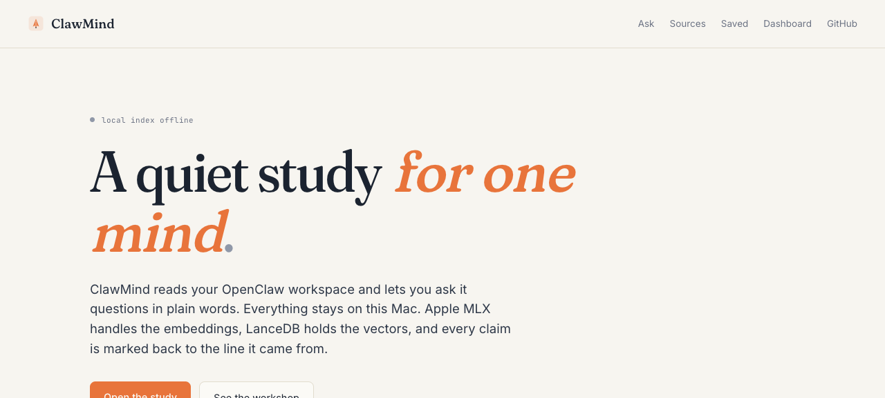

<div align="center">

# ClawMind

**A quiet study for one mind.**
Local-first RAG over your notes, sessions, and project files. Ask in plain words, get answers with every claim cited back to the line it came from.

[](https://github.com/Sanjays2402/clawmind/actions/workflows/ci.yml)
[](LICENSE)


[Website](https://sanjays2402.github.io/clawmind/) · [Quick start](#quick-start) · [Features](docs/features.md) · [CLI](docs/cli.md) · [API](docs/api-reference.md)



</div>

## Why ClawMind

Your workspace already knows the answer: it is in a session log from last Tuesday, a design note in `memory/`, or a comment in a project you have not opened in a month. ClawMind indexes that directory tree and lets you ask questions against it. The answers come back in prose with numbered marks in the margin, and each mark opens the exact file and line range it came from.

- **Nothing leaves the box.** Embeddings run on a local MLX model, vectors live in LanceDB on disk, and the default LLM is local too. Remote models are opt-in.
- **Hybrid retrieval.** BM25 for exact terms plus dense vectors for meaning, blended, reranked, and diversified with MMR.
- **Citations you can check.** Every claim links to `path:startLine-endLine`. Each mark carries its excerpt, and clicking it jumps to the source card in the rail.
- **Built for daily use.** Keyboard-first chat, a reading layout instead of chat bubbles, and threads that survive a reload.

## Highlights

| | |
| --- | --- |
| **Two-column reading layout** | Wide answer column with a sticky source rail. `[` `]` step through citations, `j` `k` move through the rail, `/` focuses the composer. |
| **Threads that stick around** | Ask follow-ups in one running thread. The thread and any half-typed question are restored after a reload. Download the whole thread as Markdown with per-exchange citations using **Export .md**. |
| **Explain view** | `/explain` shows why each chunk was picked: raw BM25, dense cosine, the normalised blend, rerank, and MMR rank, stage by stage. |
| **Namespaces** | Files are bucketed into `memory`, `sessions`, `projects`, `docs`, and `misc` by path, so you can scope a question to one corner of the workspace. |
| **Watch mode** | `clawmind watch` keeps the index fresh as files change. Unchanged files are skipped by content hash. |
| **History, pins, collections, shares** | Search every past question, tag and pin answers, group them into collections, and share a read-only link. |
| **CLI for everything** | 18 commands, including `ask`, `search`, `ingest`, `watch`, `related`, `stale`, `digest`, and `doctor`. See [docs/cli.md](docs/cli.md). |
| **Team and enterprise controls** | OIDC SSO, SCIM, scoped API keys, MFA step-up, a tamper-evident audit log, data residency, retention, and GDPR tooling. See the [feature catalogue](docs/features.md). |

## Quick start

**Requirements:** Node 20.10+, pnpm 9, Python 3.11+ (for the embedding sidecar), and an OpenAI-compatible chat endpoint at `CLAWMIND_LLM_PRIMARY_URL`.

```bash
git clone https://github.com/Sanjays2402/clawmind.git
cd clawmind
pnpm install
cp .env.example .env

# 1. Start the MLX embedding sidecar (port 7411)
(cd packages/embed/python && pip install -r requirements.txt && python server.py) &

# 2. Start the API (7410), web UI (7412), and CLI in watch mode
pnpm dev

# 3. In another shell, index something and ask about it
pnpm clawmind ingest ./samples
pnpm clawmind ask "where did I first sketch the citation rail idea?"
```

Open **<http://127.0.0.1:7412>** for the web UI, or **<http://127.0.0.1:7412/demo>** for three preloaded sample questions. To index your real workspace, run `pnpm clawmind ingest ~/.openclaw/workspace`.

Data (LanceDB, the BM25 index, the ingest manifest, and the audit log) is written to `CLAWMIND_DATA_DIR`, which defaults to `./data`. Every setting is documented in [`.env.example`](.env.example).

For guided tours of the UI with matching API calls, see [docs/walkthroughs.md](docs/walkthroughs.md).

## How it works

```
files on disk ──▶ ingest ──chunks──▶ embed (MLX sidecar) ──vectors──▶ LanceDB
                    │                                                    │
                    └────────tokens────────▶ BM25 index                  │
                                                │                        │
              question ──▶ BM25 ∥ dense KNN ◀───┴────────────────────────┘
                                │
                     hybrid blend ─▶ rerank ─▶ MMR
                                │
                     prompt (token budget) ─▶ LLM ─▶ streamed answer + [n] citations
```

1. **Ingest** walks the workspace with a gitignore-style filter, hashes each file against the manifest to skip unchanged content, loads it through a typed loader (markdown, code, JSON, PDF, HTML), and chunks it.
2. **Embed** sends chunks to the local MLX sidecar (`bge-small-en-v1.5`, 4-bit), with an OpenAI-compatible fallback.
3. **Store** writes vectors to LanceDB and tokens to an in-process BM25 index.
4. **Retrieve** runs BM25 and dense search in parallel, normalises and blends the scores (`hybridAlpha`), applies a lexical rerank and MMR for diversity, and builds a prompt under a token budget.
5. **Answer** streams the LLM response over SSE, with citation spans pointing at `path` plus a line range.

More detail is in [docs/architecture.md](docs/architecture.md) and [docs/ingest.md](docs/ingest.md).

## Stack

| Layer | Tech |
| --- | --- |
| Monorepo | pnpm workspaces, Turborepo, TypeScript, Node 20+ |
| API | Fastify 5, Zod, `@fastify/session`, `@fastify/rate-limit` |
| Web | Next.js 15 (App Router), React 19, Tailwind v4 |
| CLI | commander, ora, kleur |
| Retrieval | LanceDB (dense), BM25 persisted to JSON (lexical) |
| Embeddings | MLX sidecar (Python, FastAPI) |
| LLM | Any OpenAI-compatible chat completions endpoint |
| Observability | pino, optional OTLP traces |
| Tests | vitest, Playwright |

## Project structure

```
apps/
  api/         Fastify HTTP service (port 7410)
  cli/         the `clawmind` command
  web/         Next.js UI (port 7412)
packages/
  config/      env loading, paths, defaults
  embed/       MLX + OpenAI embed clients, Python sidecar in python/
  ingest/      loaders, chunkers, pipeline, watcher, manifest
  llm/         OpenAI-compatible chat clients with fallback
  rag/         hybrid retrieval, MMR, prompt assembly, explain
  store/       LanceDB wrapper, BM25 index, manifest, audit log
  telemetry/   pino logger, OTLP tracing
  types/       shared zod schemas and TS types
  ui/          shared React components and design tokens
infra/         Dockerfiles, Helm chart, Terraform modules
eval/          retrieval eval fixtures, questions, expected answers
samples/       a small sample workspace to try things on
site/          the GitHub Pages landing site
```

## Development

| Command | What it does |
| --- | --- |
| `pnpm dev` | API, web, and CLI in watch mode |
| `pnpm test` | All unit tests (vitest) |
| `pnpm typecheck` | `tsc --noEmit` across every package |
| `pnpm build` | Production build of every package |
| `pnpm ci:verify` | typecheck, then test, then build (the CI gate) |
| `pnpm clawmind <cmd>` | Run the workspace CLI |

Helper scripts live in `scripts/`. `seed.sh` ingests `samples/` for a quick demo. See [docs/development.md](docs/development.md) and [CONTRIBUTING.md](CONTRIBUTING.md).

## Documentation

| Doc | Covers |
| --- | --- |
| [Feature catalogue](docs/features.md) | Every feature with its rationale and a copy-paste recipe |
| [Walkthroughs](docs/walkthroughs.md) | Guided tours of the web UI |
| [CLI reference](docs/cli.md) | All 18 commands and their flags |
| [API reference](docs/api-reference.md) | Every route under `/v1` |
| [Ingest](docs/ingest.md) | Loaders, chunking, the manifest |
| [Operations](docs/operations.md) | Docker, Helm, backups, observability |
| [Security](docs/security.md) and [threat model](docs/threat-model.md) | Auth model, hardening, disclosures |
| [SCIM](docs/SCIM.md) | User provisioning from your IdP |
| [Troubleshooting](docs/troubleshooting.md) | Common problems and fixes |

## License

[MIT](LICENSE) © 2026 Sanjay Santhanam
